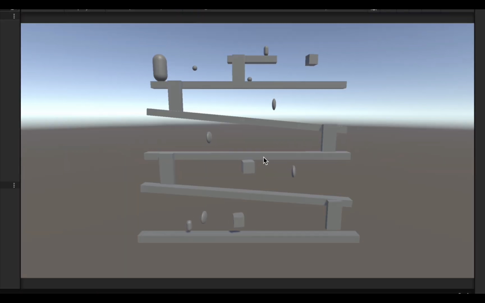

# Donkey Kong 3D
[GDD Final Documentaton](https://docs.google.com/document/d/1l9OrBGuGVYbwihyXe7x-g60jM9gm9j64HpmdHLdE-Yo/edit?tab=t.0#heading=h.nr262ujk1bmi)

[Figma Prototype](https://www.figma.com/design/fu9dyBTi70gdVvfeMDEKKT/Donkey-Kong?node-id=29-18&p=f&t=QaKka82CE67FH6ib-0)

# Team Contributions Videos

### Joy Umejiego

## Core Contributions
- **Set up the basic Unity project and created the Game Environment**  
  🔗 [PR #1](https://github.com/NamanArora332/Donkey-Kong3D/pull/1)  

- **Designed and implemented a new fight-off Power-up**  
  🔗 [PR #6](https://github.com/NamanArora332/Donkey-Kong3D/pull/6)  
  🔗 [PR #9](https://github.com/NamanArora332/Donkey-Kong3D/pull/9)  
  
   
  
  👉 *While I contributed to multiple aspects of the project, only two were recorded as per submission requirements.*

### Additional Contributions
- **Added game sounds**  
  🔗 [PR #16](https://github.com/NamanArora332/Donkey-Kong3D/pull/16)  

- **Implemented the Pause Menu**  
  🔗 [PR #17](https://github.com/NamanArora332/Donkey-Kong3D/pull/17)  

### Oluwadabira Omotoso

## Core Contributions
- **Created Donkey Kong and Handled Barrel picking and throwing**  
  🔗 [PR #3](https://github.com/NamanArora332/Donkey-Kong3D/pull/3)
  🔗 [PR #5](https://github.com/NamanArora332/Donkey-Kong3D/pull/5)

- **Designed the UI Elements: lives,game over, timer, and coin**  
  🔗 [PR #8](https://github.com/NamanArora332/Donkey-Kong3D/pull/8)
  🔗 [PR #10](https://github.com/NamanArora332/Donkey-Kong3D/pull/10) 

- **Added material assets and animations**
  🔗 [PR #15](https://github.com/NamanArora332/Donkey-Kong3D/pull/15)
  🔗 [PR #20](https://github.com/NamanArora332/Donkey-Kong3D/pull/20)
  
   

### Additional Contributions
- **Created Victory Scene**  
  🔗 [PR #22](https://github.com/NamanArora332/Donkey-Kong3D/pull/22)

### Jeena Javahar
## Core Contributions
- **Implemented Ladder Movement**
  🔗 [PR #7](https://github.com/NamanArora332/Donkey-Kong3D/pull/7)
- **Camera Shake**
  🔗 [PR #13](https://github.com/NamanArora332/Donkey-Kong3D/pull/13)
- **Particle Effects**
  🔗 [PR #21](https://github.com/NamanArora332/Donkey-Kong3D/pull/21)

### Additional Contributions

- Fixed some persistent buggy issues that were stalling development
  🔗 [PR #11](https://github.com/NamanArora332/Donkey-Kong3D/pull/11)
- Attempted implementing Fireball twice but it was not possible without refactoring existing structure.
  [branch fireball](https://github.com/NamanArora332/Donkey-Kong3D/tree/fireball)
  [branch fireball-redo](https://github.com/NamanArora332/Donkey-Kong3D/tree/fireball-redo)

https://github.com/user-attachments/assets/075c2a69-c23e-4630-9128-eedc107a2549

### Naman Arora
## Core Contributions

- **Implement Mario Movement Mechanism**
  https://youtu.be/Vv69XzHUweY [PR #4](https://github.com/NamanArora332/Donkey-Kong3D/pull/4)
- **Implement Jump Power Up**
  [PR #12](https://github.com/NamanArora332/Donkey-Kong3D/pull/12)
- ** Implement Scene Handler**
  https://youtu.be/_9ycmvZc9T8 [PR #23](https://github.com/NamanArora332/Donkey-Kong3D/pull/23)

### Additional Contributions
- Fixed bug when mario could not jump when came down ladder
  [PR #14] (https://github.com/NamanArora332/Donkey-Kong3D/pull/14)

  
  

